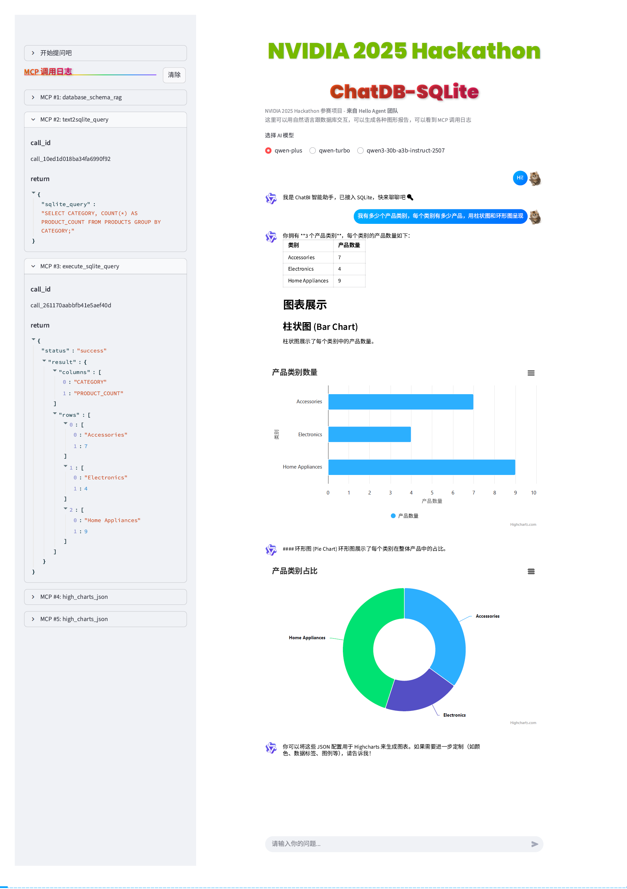
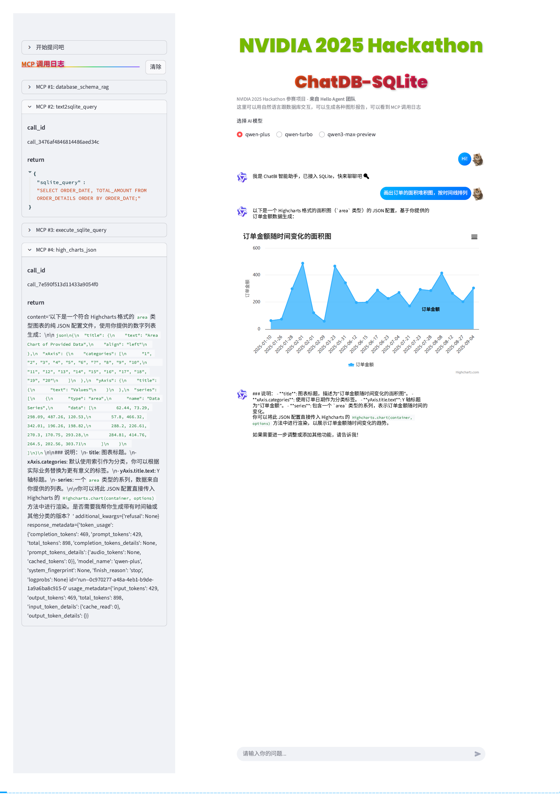
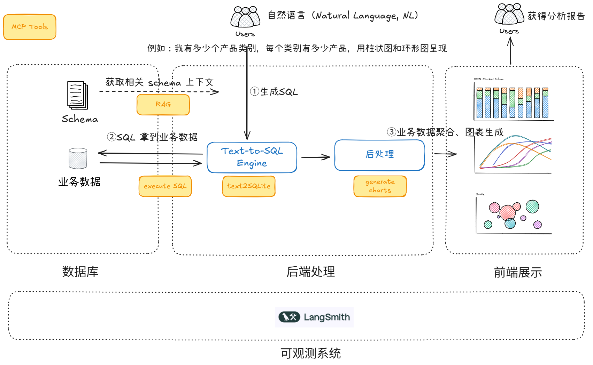

# ChatBI 智能数据对话助手
—— 来自 Hello Agent 团队

ChatBI (Chat Business Intelligence) 是一个基于 LangGraph 的智能数据对话 Agent，支持自然语言与本地 SQLite 数据库交互，自动生成 SQL 查询并可视化结果。适用于数据分析、报表生成、业务洞察等场景，无需手写 SQL，轻松获取数据洞察。


## 项目预览
### 演示视频：[ChatBI 项目演示视频 - Nvidia Hackathon 2025](https://www.bilibili.com/video/BV1nAYLzGEgy/)
### 界面介绍：
分两大部分：  
- 左边边框 “MCP 调用日志” 提供工具调用展示
- 右边对话框输入提问并呈现结果


## 主要功能

- **自然语言转 SQL**：输入中文或英文问题，自动生成并执行 SQL 查询。
- **数据可视化**：支持表格和图表展示查询结果。
- **MCP 工具集成**：已支持工具: RAG、生成SQL语句、执行SQL语句、统计图可视化。
- **执行可观测性**：提供 MCP 工具调用日志展示，tool 调用可观测。
- **会话记忆功能**：上下文记忆，支持多轮对话。
- **错误诊断自愈**：自动识别 SQL 错误并给出修复建议。

## 示例
### 示例1
提问：我有多少个产品类别，每个类别有多少产品，用柱状图和环形图呈现

### 示例2
提问：画出订单的面积堆积图，按时间线排列



## 架构图
橙色框代表了我们开发的 MCP tools，流程如下，下面用一个场景为例说明：  
1. Agent router 解析问题，决定要调用 RAG，获取与问题相关的数据库表 Schema
2. Agent router 下一步调用 tools，根据 Schema 生成 SQL
3. Agent router 下一步调用 tools，执行 SQL
4. Agent router 下一步调用 tools，生成各种图，整个流程上下文（Contex）是共享的



## 主要技术

- **Agent 框架**：LangChain / LangGraph
- **AI 模型**：阿里百炼 Qwen 系列
- **前端框架**：Streamlit
- **向量数据库**: Chromadb

## Agent 架构图


## 项目结构

- `main.py`：Streamlit 应用主入口，负责 UI 渲染、用户交互和整体流程。
- `agent.py`：智能体核心，负责大模型调用、工具管理、MCP 工具集成。
- `tools/`：工具模块目录，包括：
   - `tools_execute_sqlite.py`：SQLite 查询工具，负责 SQL 执行与结果返回。
   - `tools_text2sqlite.py`：自然语言转 SQL 工具。
   - `tools_rag.py`：数据库 schema 检索工具。
   - `tools_charts.py`：图表生成工具。
   - `mcp_time.py`：MCP 时间工具服务端，支持时区时间获取。
- `ui/sqlitechat_ui.py`：UI 组件，负责消息展示和图表渲染。
- `tools/generate_sqlite_data.py`：生成示例数据库和数据。
- `tools/ingest_chromadb.py`：生成 embedding 并写入 chromadb。
- `docs/`：数据库表结构说明（如 `customer_details.md`、`order_details.md` 等）。
- `sql/`：数据库建表 SQL 文件。
- `example.db`：示例 SQLite 数据库。
- `assets/`：项目图片资源文件夹。

## 安装与运行

1. 克隆项目：
   ```bash
   git clone https://github.com/yourusername/ChatBI.git
   cd ChatBI
   ```

2. 安装依赖（建议使用虚拟环境）：
   ```bash
   uv sync
   ```

3. 添加 API_KEY
   复制 .env.example，添加所需 API_KEY


4. 生成 Embedding 并写入向量数据库
   ```bash
   cd tools
   python ingest_chromadb.py
   ```

5. 生成示例数据库（可选）：
   ```bash
   cd tools
   python generate_sqlite_data.py
   ```

6. 启动应用：
   ```bash
   streamlit run main.py
   ```

## 数据库结构示例

- 客户表（CUSTOMER_DETAILS）：客户信息
- 订单表（ORDER_DETAILS）：订单信息
- 产品表（PRODUCTS）：产品信息
- 支付表（PAYMENTS）：支付记录
- 交易表（TRANSACTIONS）：交易流水

详细字段见 `docs/` 文件夹。

## 贡献方式

欢迎提交 PR 或 Issue，完善功能、修复 Bug 或优化体验。

## 鸣谢

本项目受到该开源项目启发：https://github.com/kaarthik108/snowChat

## 许可证

MIT License
